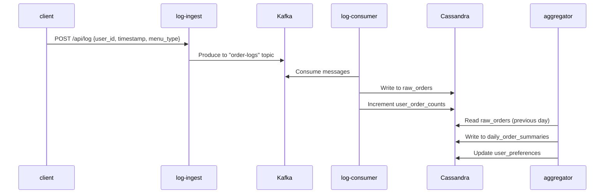
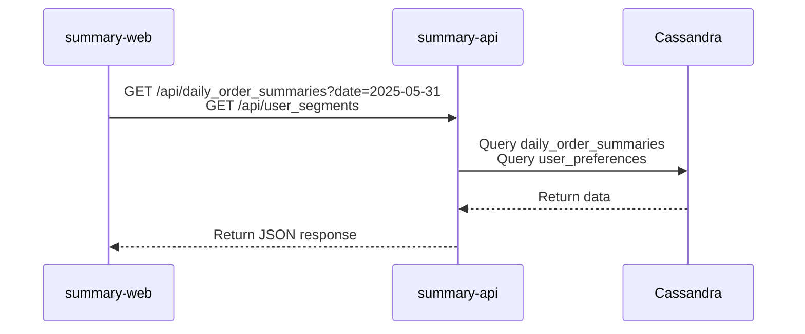

https://github.com/Tomoki108/analyze-poc
勉強のために、表題のようなものを土日で作成しました。以下 README をそのまま掲載します。

## 目的

- 注文ログをもとに、ユーザーの嗜好、日毎の注文状況を抽出・可視化する POC を構築。
- 「Kafka による非同期処理」「Cassandra によるデータ管理」を活用した、スケーラブルなアーキテクチャの経験。

## ユースケース

- 和食の注文数、洋食の注文数について日次のデータを閲覧できる。（前日の注文ログを集計）
- 注文ログをもとに、各ユーザーの嗜好（和食派/洋食派）を判定。それぞれの数、該当するユーザー ID をリスト表示できる。（前日の注文ログを元に毎晩差分更新）

### 活用方法

- 洋食と和食のどちらが好まれているのか、そのトレンドを把握する
- ユーザーの嗜好に基づいたマーケティング施策の検討（ex, 嗜好に応じた適切なクーポンの配布）

# アーキテクチャ

## サービス構成

- **log-ingest (Go, Echo)**: 注文ログを受信し、Kafka にプロデュースする API
- **log-consumer (Go)**: Kafka から注文ログを消費し、Cassandra に永続化するワーカー
- **aggregator (Python)**: 前日の注文データを集計し、サマリーデータを生成するバッチ処理
- **summary-api (Go, Echo)**: 集計済みデータをクライアントに提供する API
- **summary-web (Vue.js)**: 集計データを可視化する Web フロントエンド

## シーケンス図

### ログ受信から集計までの流れ



### 集計データの取得



## データモデル (Cassandra)

[schema def](https://github.com/Tomoki108/analyze-poc/blob/main/cassandra/init/01_create_keyspace_and_tables.cql)

## 設計のポイント

### Kafka によるログ書き込みの非同期化

- DB への書き込みを非同期化することで、ログ送信のパフォーマンスを向上。スパイク時の Cassandra への負荷もコントロール。

### 効率的な嗜好の判定、更新、取得

- ユーザーが和食派/洋食派かは通算の注文数で判定。通算注文数はログ出力の度にインクリメント。
- ログ出力の度に嗜好を再判定すると、「通算注文数のインクリメント」「通算注文数の取得」「嗜好の再判定、更新」で 3 回の読み書きが発生しパフォーマンスが低下する。
- 日次バッチで、前日注文があったユーザーに限定して嗜好を再判定することで、パフォーマンスを改善する。（1 日に 1 ユーザーが 10 回注文するとしたら、「通算注文数の取得」「嗜好の再判定、更新」のクエリ回数を 1/10 に削減。）
- ユーザー嗜好テーブル `user_preferences` は `preferred_menu_type` カラムをパーティションキーに持つため、嗜好セグメントごとにユーザー ID リストを効率よく取得可能。

### リスク

- 現在の設計だと `menu_type` の値が増えると、Cassandra へのカラム追加が必要。メニューの増減に伴い DB のスキーマ変更が必要になり、さらに廃止メニューのデータが残りデータ量が嵩むリスクがある。
  - ユーザー別注文カウンタテーブル `user_order_counts` について、`menu_type` カラムを追加しパーティションキーに設定するような**設計変更が必須**。
- **Kafka からのメッセージ消費時にエラーが発生した場合などのリトライメカニズムの実装が必須**。
  - Dead Letter Queue (DLQ) の実装や、メッセージの再処理を行う仕組みが必要。
- **監視・メトリクスの仕組みの構築が必須**。
  - OpenTelemetry などの導入。

## 動作確認

- 初期化
  ```bash
  # コンテナビルド、起動
  make dbu-containers
  # Kafka トピック作成
  make create-topics
  # Cassandra スキーマ作成：
  make init-cassandra
  ```
- ログストリーム再現
  ```bash
  ./log-stream-test.sh 2025-05-31
  ```
- 集計クエリ実行
  ```bash
  make run-aggregator date=2025-05-31
  ```
- レポート UI で確認：http://localhost:8081/

<!-- user_segments.pngを表示 -->


